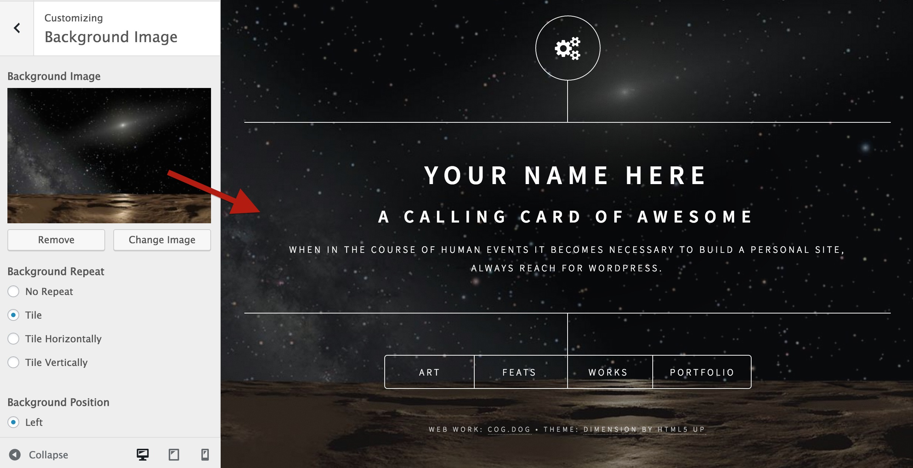

# HTML5up Dimension Theme for Wordpress

A configurable Wordpress Theme version of [HTML5up Dimension Theme](https://html5up.net/uploads/demos/dimension/) made for the internet by [@cogdog](http://cog.dog). It creates a simple, elegant calling card something that looks like

The box links below open content overlays (each is a Wordpress post) with optional links to external sites:

## Examples

* Original version created for http://marianafun.es/me

## Installing

Downloading this repo as zip can be used to upload as a theme to any hosted Wordpress site. No luck on Wordpress.com, get a real web hosting package.

## Customizing with the Customizer

The main elements are set and previewed in `Appearance` -> `Customize`

### Site Name and Tagline. Anything you want!
Under `Site Identity` edit to define the headline elements (leave blank to remove)

### Set Background. So cool!
Under `Background Image` upload an image (bigger than 1024px wide is best) to place a background image

### Front Quote and Footer
Under `Dimension Front Text` edit fields to add an optional quote (appears below tagline) and custom footer text

### Front Icon
Under `Dimension Logo` upload your own image. Amazing!

## Buttons! On the Bottom!

The content for the lower row of buttons is driven by plain old posts. You can have up to 8, 4 or 6 look better.

For each create a post. Keep the title short or... well you will see, it will look ugly.

A featured image os optional, but will appear on the content overlay. The order of the buttons is via the post sidebar option for... **Order**

You can optional generate the link for the featured image and a bottom button to go to a designated URL. This is managed via the `Links Info` box below the post content

The `Font Awesome Icon Button` can be changed to anything available from [Font Awesome](http://fontawesome.io/icons/). Wild, eh?

## Caveat Emptor
This is a first release! Updates shall be done! Some things on my list:

* Display and show menu order in the posts view of the Wordpress Editor
* *you tell me* Fork and edit to suggest features or [toss them into the Issues bin](https://github.com/cogdog/wp-dimension/issues)
