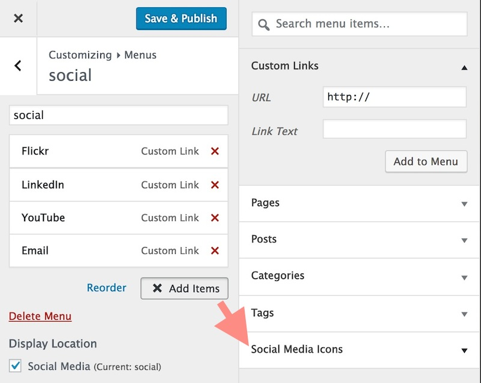
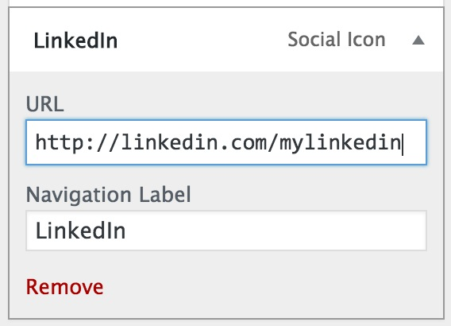
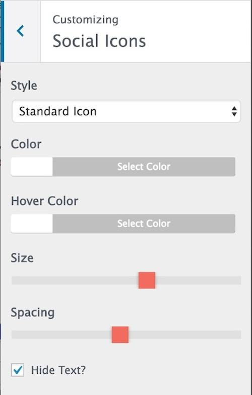
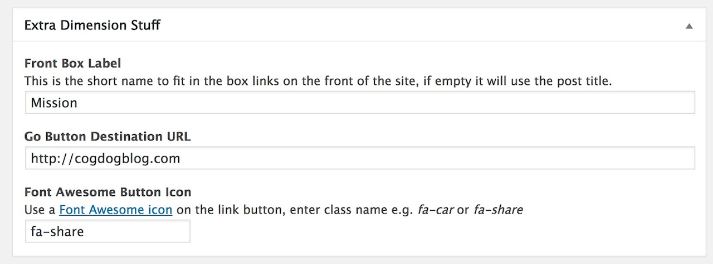

# HTML5up Dimension Theme for Wordpress

A configurable Wordpress Theme version of [HTML5up Dimension Theme](https://html5up.net/dimension) made for the internet by [@cogdog](http://cog.dog). It creates a simple, elegant calling card something that looks like

The box links below open content overlays (each is a Wordpress post) with optional links to external sites or to a Wordpress Page created on the same site:

Now you can also create standalone WordPress pages in case you have more info than you want to show in a front box, so it can link internally to a full page.

## Examples

* Original version created for http://marianafun.es/
* http://about.digis.im/
* SPLOT demo site http://splot.ca/domains2017/

## Installing

Install these theme on any self hosted Wordpress site. No luck on Wordpress.com, get a real web hosting package.

You should download a ZIP file of this GitHub Repo (that's via the green **Clone or Download*" button above as a file `wp-dimension-master.zip`). 

The zip can be uploaded directly to your site via Add Themes in the Wordpress dashboard. Of you run into size upload limits or just prefer going old school like me, unzip the package and ftp the entire folder into your `wp-content/themes` directory.

## Updating the Theme

If you have ftp/sftp access to your site (or this can be done in a cpanel file manager), simply upload the new theme files to the `wp-content/themes` directory that includes the older version theme. 

For those that lack direct file upload access or maybe that idea sends shivers down the spine, upload and activate the [Easy Theme and Plugin Upgrades](https://wordpress.org/plugins/easy-theme-and-plugin-upgrades/) plugin -- this will allow you to upload a newer version of a theme as a ZIP archive.

## Customizing with the Customizer

The main elements are set and previewed in `Appearance` -> `Customize`

### Site Name and Tagline. Anything you want!
Under `Site Identity` edit to define the headline elements (leave blank to remove)

### It says Set Headers but it's really Set Background. So sneaky!
Under `Header Image` upload an image (recommended size 1568 x 1024 px or bigger) to place a background image

The reason we use Header image controller, is you can upload more than one image, and use the option to randomize each time.

### Front Quote and Footer
Under `Dimension Front Text` edit fields to add an optional quote (appears below tagline) and custom footer text

Any Footer text added will be placed before the current credits line at the bottom.

### Front Icon
Under `Dimension Logo` upload your own image. Amazing!

### Social Media Icons

To have a customized set of icon links, install and activate the [Customizer Social Icons](https://wordpress.org/plugins/customizer-social-icons/) plugin. This allows you to create a menu of links to social media sites.

Open the Customizer, and look under Menus to add a new menu. Under **Display Location** check the box for `Social Media`. Now when you look at the menus, open the entry for this new menu and click **+ Add Items**

Open the menu under `Social Media Icons` - it will be added as  a new menu item on the list. Open up the new item, and the link to your own address in a particular site:

Menu items can be re-ordered by drag and drop.

Return to the main screen for the Customizer, and open the panel for **Social Icons**. Here you can select icon styles, color, size, and spacing.

## Buttons! On the Bottom!

The content for the lower row of buttons is driven by plain old posts. You can have up to 8, but 4 or 6 look better.

For each create a post. You can use long titles.

A featured image os optional, but will appear on the content overlay. The order of the buttons is via the post sidebar option for... **Order**

Look for a few more settings in  **Extra Dimension Stuff** box below the post content. The text entered in `Front Button Label` will be what is used to diplay the link in the box on the front page. If left blank, the theme will use the text of the post title.

You can also enter the optional link for the featured image and a bottom button to go to a designated URL. 

Enter under `Go Button Destintion URL` the web address the bottom button should link to. The `Font Awesome Icon Button` can be changed to anything available from [Font Awesome](http://fontawesome.io/icons/). Wild, eh?

## Note on Featured images

The featured images displayed for each post will be scaled down to fit a size with an aspect ratio of 480px wide and 200px high. Wordpress can never scale an uploaded image large than the original

**The image you upload needs to be bigger than this in both dimensions** It will be scaled and cropped to the center of the image. If you do not want to experience cropping, creating your image with the same aspect ratio (it can be larger, e.g. 960x400).

## Suggested Plugins

* [Customizer Social Icons](https://wordpress.org/plugins/customizer-social-icons/) is needed to activate the social media icons on the front page
* [Fluid Video Embeds](https://wordpress.org/plugins/fluid-video-embeds/) will make sure your auto embedded videos (and other content wordpress can embed by URL) are responsive sized to fill the column width
* [Easy Theme and Plugin Upgrades](https://wordpress.org/plugins/easy-theme-and-plugin-upgrades/) allows you yo update the theme by uploading the zip file again as a new server (because wordpress does not provide this capability)
* [JetPack](https://wordpress.org/plugins/jetpack/) can add a number of capabilities, such as adding a contact form. If you do [create a contact form](https://jetpack.com/support/contact-form/), make sure you also add and activate [Akismet](http://akismet.com/) because *you will get spam*

## Features / History

* v1.3 (Aug 21, 2017)  Integration of Social Media Icons for the WordPress Customizer plugin to provide a front page display of icons / links for social media sites, new post meta data field option to store an optional short name for the button display, CSS updates for 'aligncenter, alignleft, alignright classes, edit links added to post display.
* v1.2 (Jun 19, 2017)  Added a page template to create longer content pieces
* v1.1 (May 20, 2017) Added shortcodes for link buttons, display and show  order in the posts view of  Wordpress Editor
* v1.0 (Feb 19, 2017) First release http://cogdogblog.com/2017/02/new-dimension/

### Requests

* *you tell me* Fork and edit to suggest features or [toss them into the Issues bin](https://github.com/cogdog/wp-dimension/issues)
