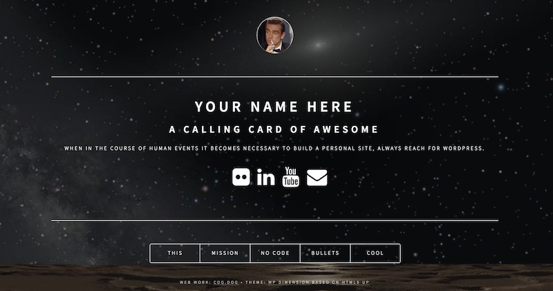
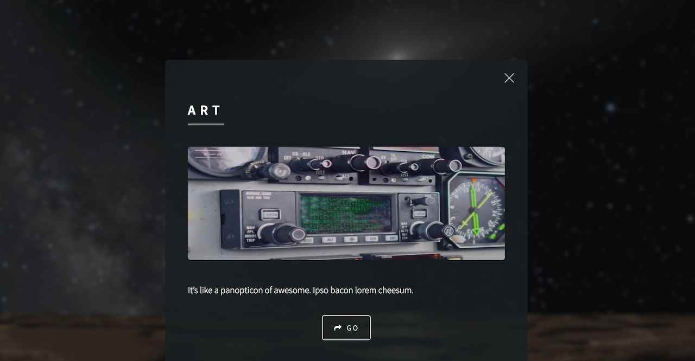
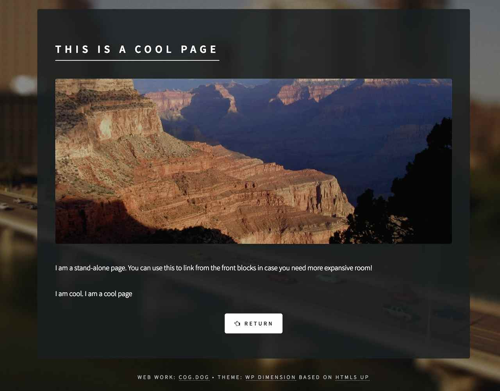
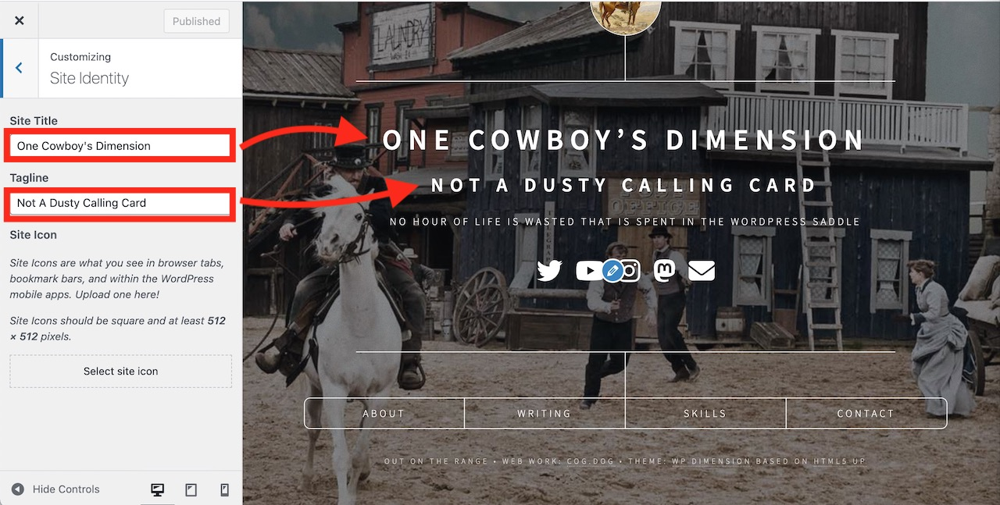
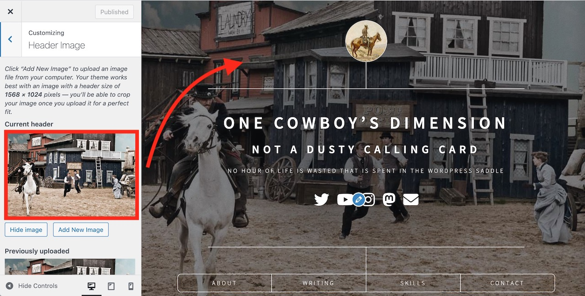
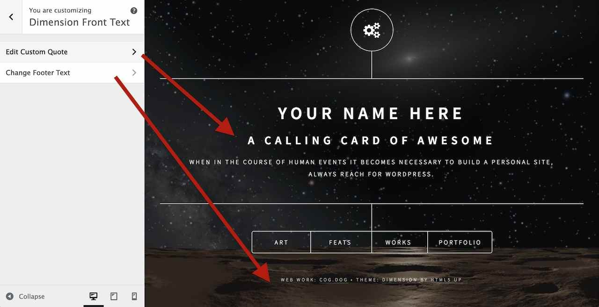
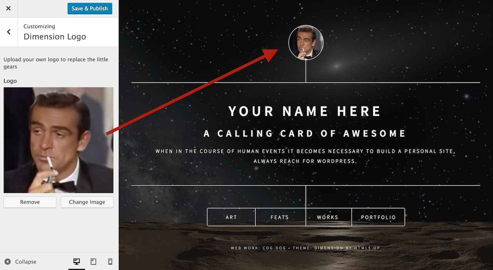
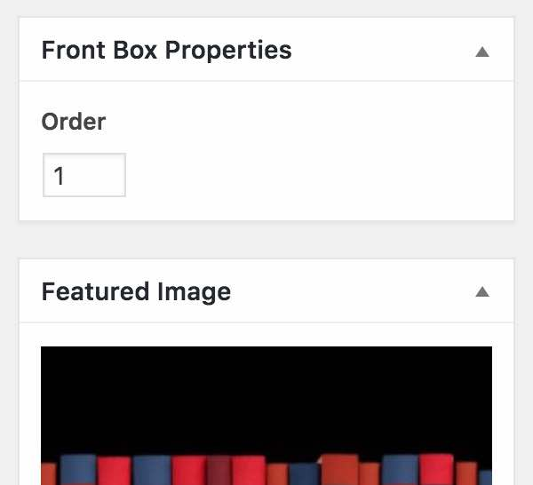
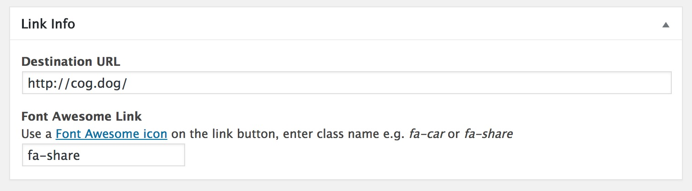

# HTML5up Dimension Theme for Wordpress

A configurable Wordpress Theme version of [HTML5up Dimension Theme](https://html5up.net/dimension) made for the internet by [@cogdog](http://cog.dog). It creates a simple, elegant calling card something that looks like

The box links below open content overlays (each is a Wordpress post) with optional links to external sites:

Now you can also create standalone WordPress pages in case you have more info than you want to show in a front box, so it can link internally to a full page

## Examples

* Original version created for http://marianafun.es/
* http://about.digis.im/
* SPLOT demo site http://splot.ca/domains2017/

## Installing

Install these theme on any self hosted Wordpress site. No luck on Wordpress.com, get a real web hosting package.

You should download a ZIP file of this GitHub Repo (that's via the green **Clone or Download*" button above as a file `wp-dimension-master.zip`). 

The zip can be uploaded directly to your site via Add Themes in the Wordpress dashboard. Of you run into size upload limits or just prefer going old school like me, unzip the package and ftp the entire folder into your `wp-content/themes` directory.

## Customizing with the Customizer

The main elements are set and previewed in `Appearance` -> `Customize`

### Site Name and Tagline. Anything you want!
Under `Site Identity` edit to define the headline elements (leave blank to remove)

### It says Set Headers but it's really Set Background. So sneaky!
Under `Header Image` upload an image (recommended size 1568 x 1024 px or bigger) to place a background image

The reason we use Header image controller, is you can upload more than one image, and use the option to randomize each time.

### Front Quote and Footer
Under `Dimension Front Text` edit fields to add an optional quote (appears below tagline) and custom footer text

Any Footer text added will be placed before the current credits line at the bottom.

### Front Icon
Under `Dimension Logo` upload your own image. Amazing!

## Buttons! On the Bottom!

The content for the lower row of buttons is driven by plain old posts. You can have up to 8, 4 or 6 look better.

For each create a post. Keep the title short or... well you will see, it will look ugly.

A featured image os optional, but will appear on the content overlay. The order of the buttons is via the post sidebar option for... **Order**

You can optional generate the link for the featured image and a bottom button to go to a designated URL. This is managed via the `Links Info` box below the post content

The `Font Awesome Icon Button` can be changed to anything available from [Font Awesome](http://fontawesome.io/icons/). Wild, eh?

## Features / History

* v1.2 (Jun 19, 2017)  Added a page template to create longer content pieces
* v1.1 (May 20, 2017) Added shortcodes for link buttons, display and show  order in the posts view of  Wordpress Editor
* v1.0 (Feb 19, 2017) First release http://cogdogblog.com/2017/02/new-dimension/

### Requests

* *you tell me* Fork and edit to suggest features or [toss them into the Issues bin](https://github.com/cogdog/wp-dimension/issues)
