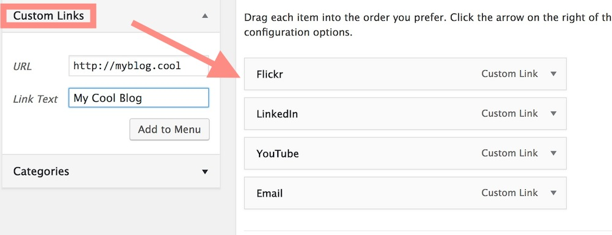
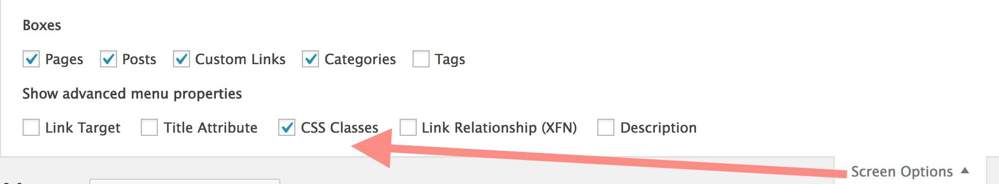
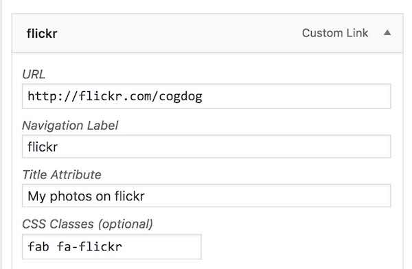
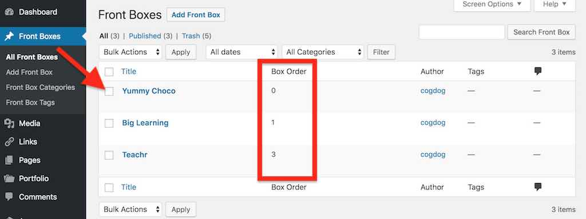

# HTML5up Dimension Theme for Wordpress

-----
*If this kind of stuff has any value to you, please consider supporting me so I can do more!*

 

----- 

A configurable Wordpress Theme version of [HTML5up Dimension Theme](https://html5up.net/dimension) made for the internet by [@cogdog](http://cog.dog). It creates a simple, elegant calling card site, something that looks like

The box links below the headings each open content overlays, each a Wordpress post, internally on the site renamed "Front Boxes": 

Editing options in the posts/front pages provide the means to add a button and link at the bottom that can go to any URL. You can also create standalone WordPress pages in case you have more info than you want to show in a front box.

## Examples

* Alison Crump http://alisoncrump.ca/research/
* Ancestors in the Archives http://ancestorsinthearchives.com/
* Asako Yoshida https://aozora.ca/me
* BC Academic Integrity Network https://bcain.trubox.ca/
* Bild-Lida (Belonging, Identity, Language, Diversity Research Group (BILD) // Groupe de Recherche Langage, Identité, Diversité, Appartenance (LIDA)) http://bild-lida.ca/
* Buffscreate Community http://possibility.buffscreate.net/
* Chris Lott https://chrislott.org/
* CogDog (that's me!) https://cog.dog/
* Coventry University Art and Design Skills Hub http://origin.coventry.domains/
* Cowboy flavored demo http://lab.cogdogblog.com/dimension/
* Dan Zuberbier http://dpzuberbier.com/
* Daniel Villar-Onrubia http://daniel.coventry.domains/
* Davie Quinn http://eduquinn.com/
* Debby Tran http://staff.washington.edu/detran/
* Discover WISR: The Western Institute for Social Research  https://discover.wisr.faberglas.com/blog/
* DOOO Admin Landing Page https://stateu.org/dooo-admin/
* Extend Labs Mad Scientists https://extendlabs.ca/
* Jean Ramirez https://socioworld.openlcc.net/
* Jeff Jaxon http://www.jeffjaxon.com/
* Jon Rei https://jonrei.de/
* JR Dingwall https://jrdingwall.ca/
* Kate Thornhill https://notadigitalarchive.com/
* Ken Bauer https://kenbauer.me/
* Kim Jaxon http://www.kimjaxon.com/me/
* Kursi Yoga https://kursi-yoga.be/
* Kyle Storey http://kylona.com/
* Laura Killam http://nursekillam.com/
* Lisa Katarina Zimmermann http://lisa-zimmermann-sopran.de/en/
* Mariana Funes http://marianafun.es/
* Marie Yvette Lepage, M.S.W., R.S.W. https://www.mylepage.ca/
* Matt Croslin https://mattcrosslin.com/
* Micheal J Altman https://michaeljaltman.com/
* Norm Wright http://nostorynorm.com/
* Origin: Coventry University Art and Design Research Hub  http://origin.coventry.domains/
* PT Becca http://www.ptbecca.co.uk/
* Retrospect Prints http://www.retrospectprints.com/
* Sarah Lieselotte Helga https://sarahlieselotte.com/
* Science in the Learning Gardens http://learning-gardens.org/
* Simon Thompson http://about.digis.im/
* SPLOT presentation "A Shotgun Marriage" http://splot.ca/domains2017/
* Spring History Symposium, University of Hong Kong https://shs.history.hku.hk/
* Suzanne Thompson https://thompssw.sites.wfu.edu/
* Svea Hernandez http://www.stsci.edu/~sveash/
* Tom Fullerton http://tomfullerton.ca/
* Tech For Teaching (Conestoga College) http://techforteaching.ca/
* Thunder Fairy http://thethunderfairy.com/
* Tim Owens https://timowens.io

[Search for other examples in The Google](https://www.google.com/search?q=%22WP+DIMENSION+BASED+ON+HTML5+UP%22)

## Installing from Scratch

Install this theme on any self hosted Wordpress site. You cannot do this on Wordpress.com, get a real web hosting package.

You should download a ZIP file of this GitHub Repo (that's via the green **Clone or Download*" button above as a file `wp-dimension-master.zip`). 

The zip can be uploaded directly to your site via Add Themes in the Wordpress dashboard. Of you run into size upload limits or just prefer going old school like me, unzip the package and ftp the entire folder into your `wp-content/themes` directory.

## Updating the Theme

If you have ftp/sftp access to your site (or this can be done in a cpanel file manager), simply upload the new theme files to the `wp-content/themes` directory that includes the older version theme. 

For those that lack direct file upload access or maybe that idea sends shivers down the spine, upload and activate the [Easy Theme and Plugin Upgrades](https://wordpress.org/plugins/easy-theme-and-plugin-upgrades/) plugin -- this will allow you to upload a newer version of a theme as a ZIP archive, the same way you add a theme by uploading.

## Customizing with the Customizer

The main elements are set and previewed in `Appearance` -> `Customize`

### Site Name and Tagline. Anything you want!
Under `Site Identity` edit to define the headline elements (leave blank to remove)

### It says Set Headers but it's really Set Background. So sneaky!
Under `Header Image` upload an image (recommended size 1568 x 1024 px or bigger) to place a background image

The reason we use Header image controller, is you can upload more than one image, and use the option to randomize each time.

### Front Quote and Footer
Under `Dimension Front Text` edit fields to add an optional quote (appears below tagline) and custom footer text

Any Footer text added will be placed before the current credits line at the bottom.

### Front Icon
Under `Dimension Logo` upload your own image. Amazing!

### Social Media Icons

> **NOTE** Previous versions of the themes used the [Font Awesome 4 Menus](https://wordpress.org/plugins/font-awesome-4-menus/) plugin, which is not compatible with the latest set of [Font Awesome icons](https://fontawesome.com/icons) I have built an update to this plugin in you want access to a larger set of icons. You will also need to add `fab` to the menu class names (see below)

To have a customized set of icon links on the front of the site, download, install and activate the [Font Awesome 5 Menus](https://github.com/cogdog/font-awesome-5-menus) plugin. This allows you to add an icon to any menu item.

From the Wordpress Dashboard look under **Appearances** for **Menus**. Click **create a new menu**  name it whatever you like -- `social` is  a good choice. Under  **Menu Settings** next to **Display Location** check the box for `Social Media`. 

To add a social media (or any link), open the panel for **Custom Link**. 

Enter a title for the site and provide the URL that points to your content on that site. Add as many as you like. You can drag and drop them to change the order.

To set the icon, you must first enable the visibility of CSS classes for each menu item.  Click **Screen Options** in the upper right, and check the box for **CSS Classes**.

Open an item in your Social Menu and you will now see a field for entering CSS Class names. You have the choice to add from [well over 1400 icons in the Font Awesome free collection](https://fontawesome.com/icons?d=gallery&m=free). Find the name of the icon you wish to use, and enter it's all of it's class names as listed,

For example these are the class names to render the icon for typical social media sites (these should be all lower case):

* fab fa-twitter
* fab fa-facebook
* fab fa-youtube
* fab fa-linkedin
* fab fa-instagram
* fab fa-flickr

With the Font Awesome icons, you can add any site you wish to be represented on the front page and pick the icon you prefer.

**Save** your menu and check out the spiffy icons up front. 

In addition, if you want to provide a tool tip hover for the icons, look again under  **Screen Options** and enable the option for **Title Attribute**. This adds another editable field to add the tooltip text.

This provides a tool tip like

## Buttons! On the Bottom!

The content for the lower row of buttons is driven by plain old posts; inside of WordPress they are named "Front Boxes". You can have up to 8, but 4 or 6 look better.

For each create a new Front Box. You can use long titles.

A featured image is optional; they will appear on the content overlay for the box. 

The order of the front page boxes is via the post sidebar option in the box labeled "Front Box Properties" for... **Order**

Use numbers to indicate which ones should appear first, left to right. They do not need to successive numbers, e.g. 1,2,3,4. You will see this listed under "Box Order" when viewing "All Front Boxes" in the WordPress Dashboard.

## Extra "Stuff" on Front Boxes

Look for a few more settings in  **Extra Dimension Stuff** box below the post content. The text entered in `Front Button Label` will be what is used to diplay the link in the box on the front page. If left blank, the theme will use the text of the post title. The label allows you to use a longer title when the box opens up.

You can also enter and optional link applied to the featured image and a bottom button to go to a designated URL. 

Enter under `Go Button Destintion URL` the web address the bottom button should link to. You can edit the label on the button as well (if left blank it will be `Go`) The `Font Awesome Icon Button` can be changed to anything available from [Font Awesome](http://fontawesome.io/icons/). 

## Shortcodes

The same buttons that are placed at the end of content based on the settings above can be added to any post via a shortcode:

    [linkbutton 
       url="https://nationalcowboymuseum.org/awards-halls-of-fame/" 
       text="Hall of Fame" 
        icon="fa-trophy"
    ]

These are made by including in your post code like:

Where:

* **url**is the address to send a visitor to when they click the button.
* **text** the label for the button
* **icon** is the [Font Awesome 4.7 name for an optional icon](https://fontawesome.com/v4.7.0/icons/) to include on the button.

## Note on Featured images

The featured images displayed for each post will be scaled down to fit a size with an aspect ratio of 480px wide and 200px high. Wordpress can never scale an uploaded image large than the original

**The image you upload needs to be bigger than this in both dimensions** It will be scaled and cropped to the center of the image. If you do not want to experience cropping, creating your image with the same aspect ratio (it can be larger, e.g. 960x400).

## Suggested Plugins

* [Font Awesome 5 Menus](https://github.com/cogdog/font-awesome-5-menus) used to add the icons to the social media links below the tag line
* [Fluid Video Embeds](https://wordpress.org/plugins/fluid-video-embeds/) will make sure your auto embedded videos (and other content wordpress can embed by URL) are responsive sized to fill the column width
* [Easy Theme and Plugin Upgrades](https://wordpress.org/plugins/easy-theme-and-plugin-upgrades/) allows you to update the theme by uploading the zip file again as a new server (because wordpress does not provide this capability)
* [JetPack](https://wordpress.org/plugins/jetpack/) can add a number of capabilities, such as adding a contact form. If you do [create a contact form](https://jetpack.com/support/contact-form/), make sure you also add and activate [Akismet](http://akismet.com/) because *you will get spam*
* [Regenerate Thumbnails](https://wordpress.org/plugins/regenerate-thumbnails/) If you change to this theme from another one, you should run this plug to re-generate previously uploaded images in the specific sizes used by the theme.

## Features / History

* v2.0 (Feb 25, 2020) Better CSS for a responsive and even sized navigation menu.
* v1.8 (Oct 12, 2018) Nag notices added to encourage use of FontAwesome 5 plugin, CSS tweak to fix mobile menus, segment base CSS from WordPress
* v1.7 (Oct 12, 2018) Rebranded WordPress posts internally as "Front Boxes" to better reflect their purpose. A new template for single entries shows a Front Box opened on the home page.
* v1.4 (Jan  3, 2018)  Deprecated use of Customizer Social Icons plugin and re-wrote instructions to use Font-Awesome 4 Menus
* v1.3 (Aug 21, 2017)  Integration of Social Media Icons for the WordPress Customizer plugin to provide a front page display of icons / links for social media sites, new post meta data field option to store an optional short name for the button display, another field to customize the link button label, CSS updates for `aligncenter`, `alignleft`, `alignright classes`, edit links added to post display.
* v1.2 (Jun 19, 2017)  Added a page template to create longer content pieces
* v1.1 (May 20, 2017) Added shortcodes for link buttons, display and show  order in the posts view of  Wordpress Editor
* v1.0 (Feb 19, 2017) First release http://cogdogblog.com/2017/02/new-dimension/

### Requests

* *you tell me* Fork and edit to suggest features or [toss them into the Issues bin](https://github.com/cogdog/wp-dimension/issues)
