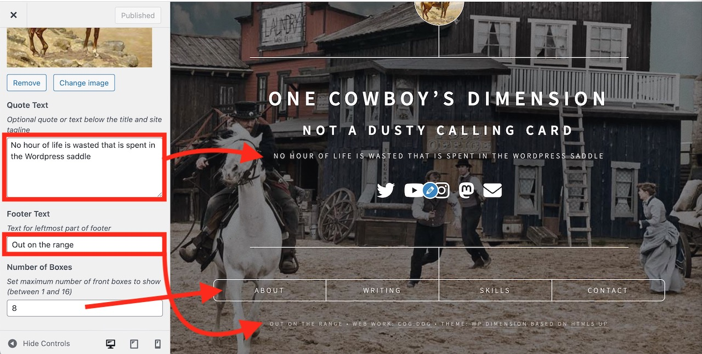

# WP-Dimension Documentation
by Alan Levine http://cog.dog/ 

These instructions are a reference for the settings and other features within the [WP-Dimension WordPress theme](https://github.com/cogdog/wp-dimension) (look there for more details about the theme, examples, how to blame me for problems, etc).

## Customizing with the Customizer

The main elements are set and previewed in `Appearance` -> `Customize`

### Site Name and Tagline. Anything you want!
Under `Site Identity` edit to define the headline elements (leave blank to remove)


### It says Set Headers but it's really Set Background. So sneaky!
Under `Header Image` upload an image (recommended size 1568 x 1024 px or bigger) to place a background image


The reason we use Header image controller, is you can upload more than one image, and use the option to randomize each time.

The other theme specific options are now under a **WP-Dimension** panel listed in Customizer

### Front Icon
Under `Dimension Logo` upload your own image. Amazing!


### Edit Front Quote and Footer Tr=ex
Under `Quote` edit fields to add an optional quote that appears below tagline. Use `Footer Text` to modify the left portion of footer text




### Number of Boxes

Use this to limit the maximum number of boxes that appear on the front, from 1 to 16 allowed now.


### Social Media Icons

To have a customized set of icon links on the front of the site, download, install and activate the [Iconic Awesome Fonts For Menus](https://github.com/cogdog/font-awesome-5-menus) plugin. This allows you to add an icon to any menu item and is currently able to use all free Font Awesome icons through version 6.2.

Once this activated in the plugins area, click **Settings** or look in the Dashboard under **Settings** -- **Font Awesome Menus**. Under **Load Font Awesome From:** select the last option `Don’t load Font Awesome’s stylesheet` because this theme already includes Font Awesome.

Now, you can set up a menu to include your social media icon links. From the Wordpress Dashboard look under **Appearances** for **Menus**. Click **create a new menu**  name it whatever you like -- `social` is  a good choice. Under  **Menu Settings** next to **Display Location** check the box for `Social Media`. 

To add a social media (or any link), open the panel for **Custom Link**. 


Enter a title for the site and provide the URL that points to your content on that site. Add as many as you like. You can drag and drop them to change the order.

To set the icon, you must first enable the visibility of CSS classes for each menu item.  Click **Screen Options** in the upper right, and check the box for **CSS Classes**.


Open an item in your Social Menu and you will now see a field for entering CSS Class names. You have the choice to add from [well over 465 icons in the Font Awesome Brands free collection](https://fontawesome.com/search?o=r&m=free&f=brandse). Find the name of the icon you wish to use, and click to find it's class names. For example, [the entry for Twitter's icon](https://fontawesome.com/icons/twitter?s=&f=brands) indicates it's code is:

```
<i class="fa-brands fa-twitter"></i>
```

To work in his plugin, we convert this to:

```
fab fa-twitter
```

Here are class names to render the icon for typical social media sites (these should be all lower case):

* fab fa-twitter
* fab fa-mastodon
* fab fa-facebook
* fab fa-youtube
* fab fa-linkedin
* fab fa-instagram
* fab fa-flickr
* fab fa-tiktok
* fab fa-github


With the Font Awesome icons, you can add any site you wish to be represented on the front page and pick the icon you prefer.

**Save** your menu and check out the spiffy icons up front. 


In addition, if you want to provide a tool tip hover for the icons, look again under  **Screen Options** and enable the option for **Title Attribute**. This adds another editable field to add the tooltip text.


This provides a tool tip like


## Buttons! On the Bottom!

The content for the lower row of buttons is driven by plain old posts; inside of WordPress they are named "Front Boxes". You can have up to 16, but 4 or 6 look better.

For each create a new Front Box. You can use long titles.

A featured image is optional; they will appear on the content overlay for the box. 

The order of the front page boxes is via the post sidebar option in the box labeled "Front Box Properties" for... **Order**


Use numbers to indicate which ones should appear first, left to right. They do not need to successive numbers, e.g. 1,2,3,4. You will see this listed under "Box Order" when viewing "All Front Boxes" in the WordPress Dashboard.


## Extra "Stuff" on Front Boxes

Look for a few more settings in  **Extra Dimension Stuff** box below the post content. The text entered in `Front Button Label` will be what is used to diplay the link in the box on the front page. If left blank, the theme will use the text of the post title. The label allows you to use a longer title when the box opens up.

You can also enter and optional link applied to the featured image and a bottom button to go to a designated URL. 


Enter under `Go Button Destintion URL` the web address the bottom button should link to. You can edit the label on the button as well (if left blank it will be `Go`) The `Font Awesome Icon Button` can be changed to anything available from [Font Awesome](http://fontawesome.io/icons/). 

## Shortcodes

The same buttons that are placed at the end of content based on the settings above can be added to any post via a shortcode:


    [linkbutton 
       url="https://nationalcowboymuseum.org/awards-halls-of-fame/" 
       text="Hall of Fame" 
        icon="fa-trophy"
    ]

These are made by including in your post code like:

Where:

* **url**is the address to send a visitor to when they click the button.
* **text** the label for the button
* **icon** is the [Font Awesome name for an optional Free Solid icon](https://fontawesome.com/search?o=r&m=free&s=solid) to include on the button.


## Note on Featured images

The featured images displayed for each post will be scaled down to fit a size with an aspect ratio of 480px wide and 200px high. Wordpress can never scale an uploaded image large than the original


**The image you upload needs to be bigger than this in both dimensions** It will be scaled and cropped to the center of the image. If you do not want to experience cropping, creating your image with the same aspect ratio (it can be larger, e.g. 960x400).

## Suggested Plugins

* [Iconic Fonts For Menus](https://github.com/cogdog/font-awesome-5-menus) used to add the icons to the social media links below the tag line (also made by me)
* [JetPack](https://wordpress.org/plugins/jetpack/) can add a number of capabilities, such as adding a contact form. If you do [create a contact form](https://jetpack.com/support/contact-form/), make sure you also add and activate [Akismet](http://akismet.com/) because *you will get spam*
* [Regenerate Thumbnails](https://wordpress.org/plugins/regenerate-thumbnails/) If you change to this theme from another one, you should run this plug to re-generate previously uploaded images in the specific sizes used by the theme.

## Updating the WP-Dimension theme

Current version [](https://github.com/cogdog/wp-dimension/blob/master/style.css)

Compare this to the version of WP-Dimension reported in your list of themes. Note that WordPress's reporting of themes being up to date does **not** reflect custom themes such as this one.  If what you see is less than the version above, here is how to update your copy of this theme. 

If you [installed WP-Dimension using the WP-Pusher plugin](https://github.com/cogdog/wp-dimension/blob/master/install.md#installing-wp-dimension-in-one-click-with-wp-pusher-get-automatic-updates), updates can be made automatic or done in one click!

Otherwise, if you installed manually, updates are not too hard to do.


*This applies if you are running WordPress on your own web hosting platform where you have the ability to install themes and plugins. If you are on a shared/multisite WordPress server, please contact your friendly technical admins and request that they update WP-Dimension.*

Custom (a.k.a unique!) WordPress themes like WP-Dimension are installed by uploading a `.zip` file. They can now be updated the same way you installed it. It's that easy! 

Just [download the newest version of WP-Dimension as a .zip ](https://github.com/cogdog/wp-dimension/archive/refs/heads/master.zip). Now in your WordPress Dashboard, go to **Themes**, then **Add Theme** and finally **Upload Theme**. You will be asked to confirm updating the theme with the newer version.  

When done, your site should report this current version as active.


## Got Questions?

This is quite a lot to take in, but these options and settings have been designed to allow you to change the way your site works that other wise would require custom programming. They also reflect the feedback of other users of WP-Dimension.

Please make use of the [Discussion space on GitHub](https://github.com/cogdog/wp-dimension/discussions/)! I love hearing from you.
