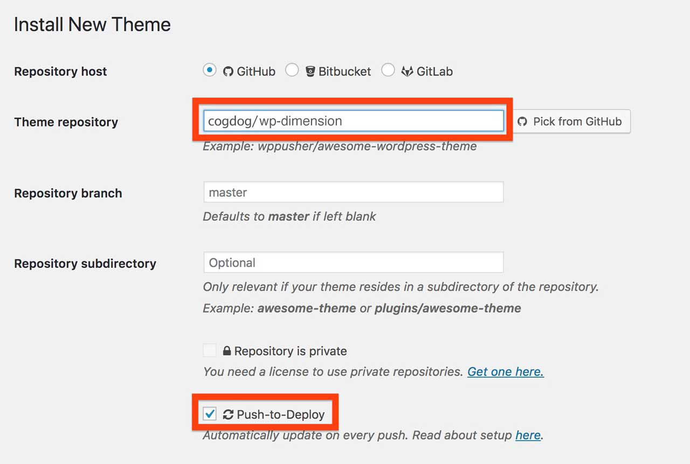

# Installing the WP-Dimension Theme

Here are your instructions for installing the [WP-Dimension theme](https://github.com/cogdog/wp-dimension).

Using this theme requires a self-hosted--or institutionally hosted (lucky you)-- Wordpress site (the kind that you download from [wordpress.org](http://www.wordpress.org). You cannot use this theme on the free "wordpress.com" site unless you have a business plan. Maybe check out [Reclaim Hosting](https://reclaimhosting.com/) if you need to set up your own hosting space. They are awesome.

### Installing WP-Dimension From Scratch

You can [download a .zip file of this theme](https://github.com/cogdog/wp-dimension/archive/refs/heads/master.zip) via the green **Code*" button above. 

The zip can be uploaded directly to your site via **Themes** in the Wordpress dashboard, then **Add Theme** and finally **Upload Theme**. If you run into size upload limits or just prefer going old school like me, unzip the package and ftp the entire folder into your `wp-content/themes` directory.

You can update the theme at any time by uploading a newer version through the same steps above (check the [theme page](https://github.com/cogdog/wp-dimension) for the current version).

### Installing WP-Dimension in One Click with WP Pusher (get automatic updates!)

To have your site stay up to date automatically, I recommend trying the [WP Pusher plugin](https://wppusher.com/) which makes it easier to install themes and plugins that are published in GitHub. It takes a few steps to set up, but it's a thing of beauty when done.

To use WP-Pusher you will need to have or create an account on [GitHub](https://github.com/) (free). Log in. 

Next [download WP Pusher plugin](https://wppusher.com/download) as a ZIP file. From the plugins area of your Wordpress dashboard, click the **Upload Plugin** button, select that zip file to upload, and activate the plugin.

Then click the **WP Pusher** option in your Wordpress Dashboard, and then click the **GitHub** tab. Next click the **Obtain a GitHub Token** button to get an authentication token. Copy the one that is generated, paste into the field for it, and finally, click **Save GitHub** Token.

Now you are ready to install WP-Dimension! 

Look under **WP Pusher** for **Install Theme**. In the form that appears, under **Theme Repository**, enter `cogdog/wp-dimension`. Also check the option for **Push-to-Deploy** (this will automatically update your site when the theme is updated) finally, click **Install Theme**.

Woah Neo?

Not only does this install the theme without any messy download/uploads, each time I update the theme on GitHub, your site will be automatically updated to the newest version. 

## After the Install

To get the WP-Dimension active on your site all you need to do is activate the "WP-Dimension" theme when it appears in the Wordpress dashboard under **Appearance** --> **Themes**.  Now you can move on to learn about setting it up in the [WP-Dimension Documentation](https://github.com/cogdog/wp-dimension/docs.md).

## Inserting Demo Content

If you want a site that is not completely empty, after setting up with WP-Pusher or from scratch, you can import all the content set up on the [public demo site](http://lab.cogdogblog.com/dimension/). 

Install all content by [downloading the WordPress export for that site](https://github.com/cogdog/wp-dimension/blob/master/data/wp-dimension.xml).  Running the WordPress Importer (under **Tools** -- **Import**) and upload that file when prompted.

